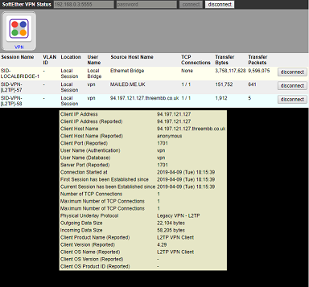

# SoftEtherWeb
A web UI for SoftEther

## Installation
```
git clone https://github.com/MatAtBread/SoftEtherWeb

cd SoftEtherWeb
npm run server
```
## Dependencies

* `node` version 10 or later installed
* `vpncmd` on the machine where this _web server_ will run

NB: For Linux/MacOSX, `vpncmd` needs to be later than this [commit](https://github.com/SoftEtherVPN/SoftEtherVPN/commit/bf8cd3550884cef5a982f24850b1c36db2a3b763), which at the time of writing means using the *SoftEther VPN Developer Edition*

## Config
...is all in `config.json`. The key value is the **location** of the `vpncmd` executable (there's space for all OS's).

## FAQs
**Q) How do I see the Web UI**

A) Start the server `npm run server`, open your browser and go to `https://localhost:8443`

**Q) Why does my browser say the site is insecure? What should I do?**

A) The repo contains development certificates, which enable SSL encryption between your browser and the server. These are 'self-signed', so your browser complains, but you can tell it to ignore the warning as you trust your own machine! If you want to run the server with self-signed certificates permanently, you should probably [generate your own](https://flaviocopes.com/express-https-self-signed-certificate/) and update the `config.json`

**Q) Why do I need SSL on this web site?**

A) ...because you enter your VPN admin password into it

**Q) What does it do?**

A) Right now, it has a basic screen for showing session status and forcing a disconnect. There's no reason it can't be easily extended to offer most SoftEther admin functions, but all I needed was a page that showed active sessions, users and traffic, and a way to disconnect sessions.

**Q) What state is this project in?**

A) It works, but it's very basic and the error handling needs work (eg restarting connections if the VPN Server is restarted)


